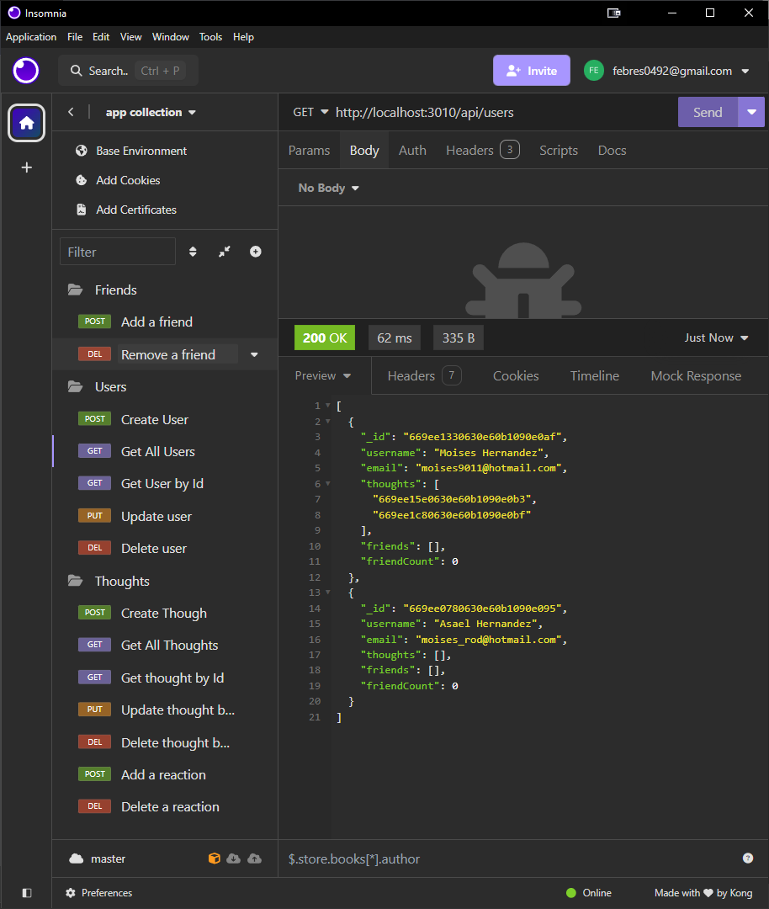

# Social Network API



<br>


## Description

This project is a backend application for a social networking platform. It allows users to share their thoughts, react to other users thoughts, and create a user profile.  
Built with Node.js and Express.js for the server, it uses MongoDB as its database with Mongoose as the Object Data Modeling library to manage data.  

<br>


[](https://bcs-tech-blog.onrender.com/)  

https://bcs-tech-blog.onrender.com/

<br>

## Table of Content
- [Features](#features)
- [Models](#models)
- [API Endpoints](#api-endpoints)
- [Installation](#installation)
- [Usage](#usage)
- [Author](#author)
- [Contribution](#contribution)
- [Questions](#questions)
- [License](#license)

<br>

## Features

- **User Profiles**: Users can create, update, and delete their profiles, as well as view profiles of other users.  
- **Thoughts**: Users can post thoughts, update them, and delete them. Each thought is linked to the user who posted it.  
- **Reactions**: Users can react to thoughts. Each thought can have multiple reactions from different users.  
- **Reaction Count**: The API calculates the number of reactions each thought has received.

<br>

## Models

### User

- **Username** : required.  
- **Email** : required, must be unique.  
- **Thoughts** : array of references to the Thought model.
- **Friends** : array of references to the User model.

### Thought

- **Thought Text** : required, 1-280 characters.
- **Created At** : default to current date, formatted with a getter method.
- **User ID** : reference to the User model, required.
- **Username** : required.
- **Reactions** : array of Reaction subdocuments.

### Reaction

**Reaction is a subdocument of Thought Model.**

- **Reaction ID** : default MongoDB ObjectId
- **Reaction Body** : required, 1-280 characters.
- **Username** : required.
- **Created At** : default to current date, formatted with a getter method.

<br>

## API Endpoints

### Users

| Action | Method : Endpoint  |
|----------------------|-------------------|
| **Create a new user** : | POST : `/api/users` <br> body JSON :  `{ "username": "new_name", "email": "new_email" }` |
| **Get all users** :  | GET : `/api/users`  |
| **Get a user by ID** :  | GET : `/api/users/:userId`  |
| **Update a user by ID** : | PUT : `/api/users/:userId` <br> body JSON :  `{ "username": "new_name", "email": "new_email" }` |
| **Delete a user by ID** :  | DELETE : `/api/users/:userId` |
| **Add a friend** :  | POST : `/api/users/:userId/friends/:friendId` |
| **Remove a friend** :  | DELETE : `/api/users/:userId/friends/:friendId` |

<br>

### Thoughts

| Action | Method : Endpoint |
|----------------------|-------------------|
| **Create a new thought** : | POST : `/api/thoughts` <br> body JSON : `{ "userId": "example", "thoughtText": "Here's a cool thought" }` |
| **Get all thoughts** : | GET : `/api/thoughts` |
| **Get a thought by ID** : | GET : `/api/thoughts/:thoughtId` |
| **Update a thought by ID** : | PUT : `/api/thoughts/:thoughtId` <br> body JSON : `{ "thoughtText": "updated_thought" }` |
| **Delete a thought by ID** : | DELETE : `/api/thoughts/:thoughtId` |

<br>

### Reactions

| Action | Method : Endpoint |
|----------------------|-------------------|
| **Add a reaction** : | POST : `/api/thoughts/:thoughtId/reactions` <br> body JSON : `{ "userId": "exampleId", "reactionBody": "example text" }` |
| **Remove a reaction** : | DELETE : `/api/thoughts/:thoughtId/reactions` <br> body JOSN : `{ "reactionId": "exampleId" }` |

<br>

## Installation

Clone the repository to your local machine.
```bash
git clone https://github.com/febres0492/bcs-social-network-api.git
cd bcs-social-network-api
npm install
```
Ensure MongoDB is running on your machine.  
Start the server with `npm start`.

<br>

## Usage

After starting the server, you can use API testing tools like Postman or Insomnia to test with the API endpoints.

<br>

## Author 
**Carlos Febres**

<br>

## Contribution
Contributions are welcome  
Please get in contact for details on our code of conduct, and the process for submitting pull requests to us.


<br>

## Questions
For questions please get in contact.  
Github Profile: https://github.com/febres0492  
Email: febres0492@gmail.com

<br>

## License

[](https://opensource.org/licenses/MIT)

This project is licensed under the MIT License - see the [LICENSE](https://opensource.org/licenses/MIT) for details.
